# Lost and Found — Entity Relationship Diagram

```mermaid
erDiagram
    User ||--o{ LostItems : "reports (User_ID)"
    User ||--o{ FoundItems : "reports (User_ID)"
    User ||--o{ ItemClaims : "submits (User_ID)"
    FoundItems ||--o{ ItemClaims : "is claimed in (FoundItem_ID)"

    User {
        string User_ID PK
        string Name
        string Email
        string Password
        string Role
    }

    LostItems {
        int LostItem_ID PK
        string User_ID FK
        string Item_Name
        string Lost_Location
        string Category
        date Date_Lost
        string Description
        string Image_Path
        string Status
        string TrackingStatus
    }

    FoundItems {
        int FoundItem_ID PK
        string User_ID FK
        string Item_Name
        string Found_Location
        string Category
        date Date_Found
        string Description
        string Image_Path
        string Status
        string TrackingStatus
    }

    ItemClaims {
        int FoundItem_ID FK
        string User_ID FK
        string Claim_Status
        datetime Claimed_At
    }
```

## Relationship summary

| Parent | Child | Cardinality | Foreign key |
| --- | --- | --- | --- |
| `User` | `LostItems` | one user reports zero or more lost items | `LostItems.User_ID` → `User.User_ID` |
| `User` | `FoundItems` | one user reports zero or more found items | `FoundItems.User_ID` → `User.User_ID` |
| `User` | `ItemClaims` | one user submits zero or more claims | `ItemClaims.User_ID` → `User.User_ID` |
| `FoundItems` | `ItemClaims` | one found item can have zero or more claims | `ItemClaims.FoundItem_ID` → `FoundItems.FoundItem_ID` |

## Evidence and assumptions

- The diagram is derived from the application's SQL statements, since the repository contains no database-creation script or SQL Server schema export.
- `User_ID`, `LostItem_ID`, and `FoundItem_ID` are treated as primary keys because they identify rows in queries and joins. The database should enforce them as such.
- `ItemClaims` is shown without a separate claim ID: the code only uses `FoundItem_ID` and `User_ID`. It should enforce a composite primary key or unique constraint on `(FoundItem_ID, User_ID)`, matching the application's duplicate-claim check.
- `TrackingStatus` is read and updated for both item tables but is not supplied during item insertion, so it likely has a database default or accepts `NULL`.
- `LostAndFoundDataSet.xsd` is an older/generated data-set schema that uses `Catagory`; the active forms and search queries use `Category`. The diagram follows the active application SQL.
